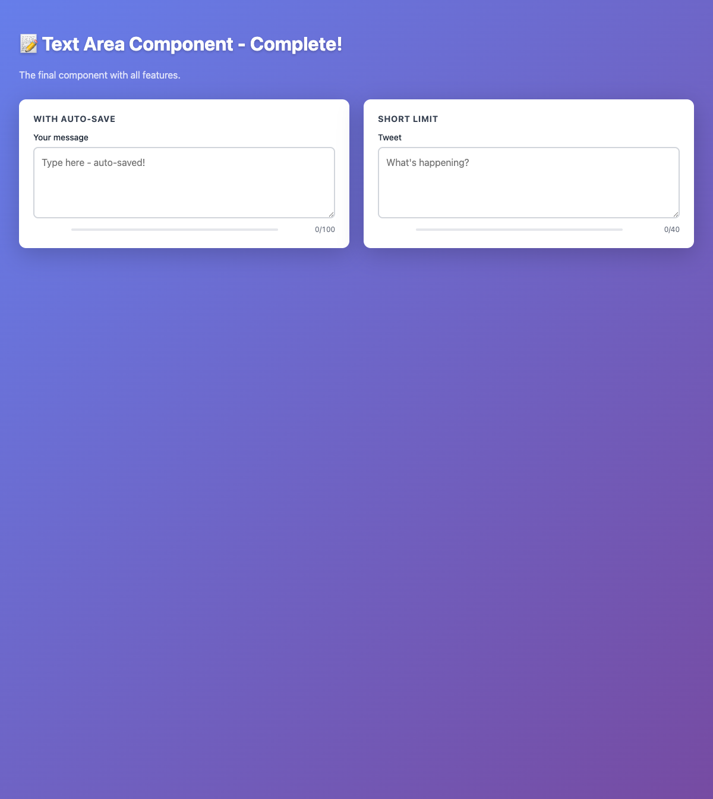
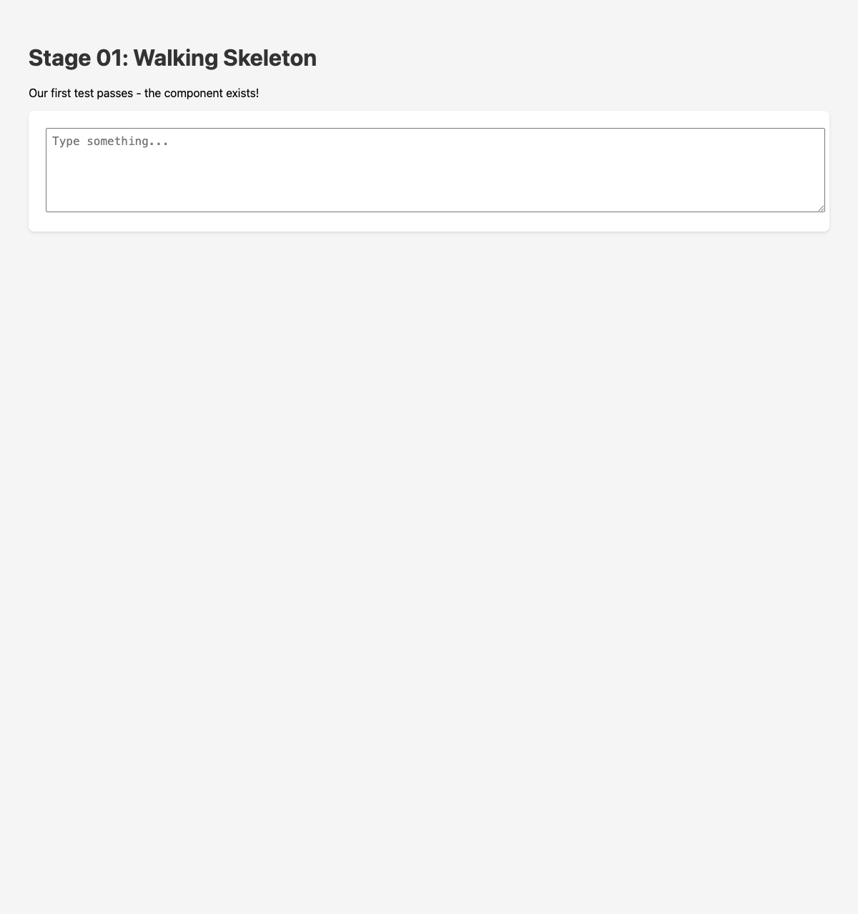
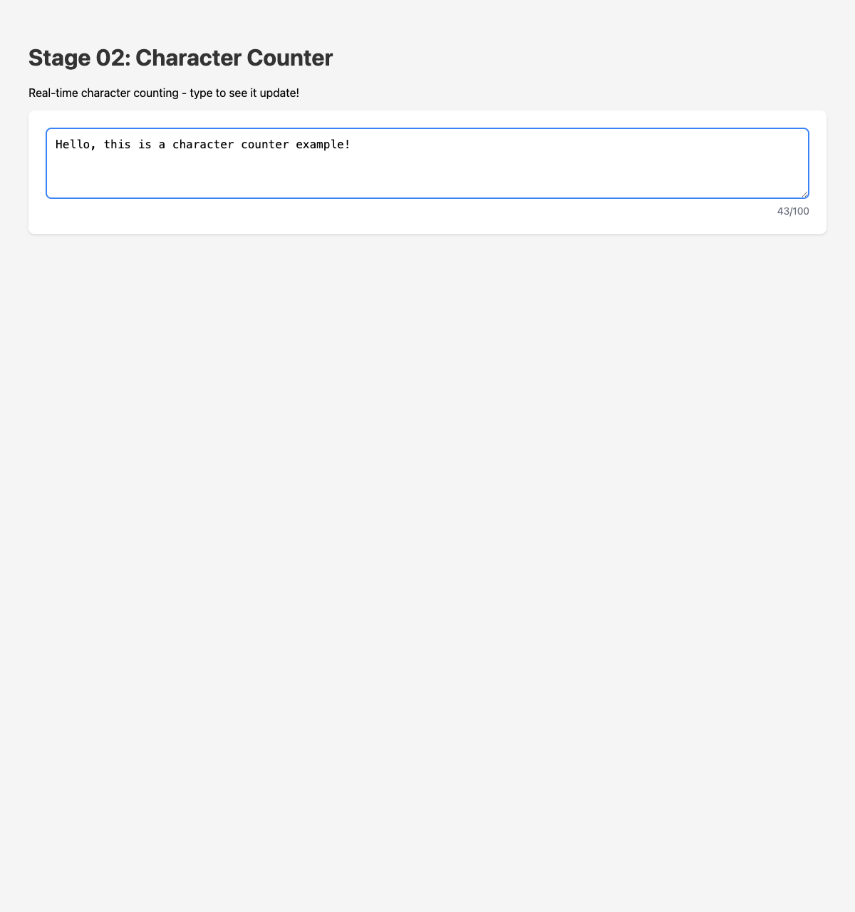
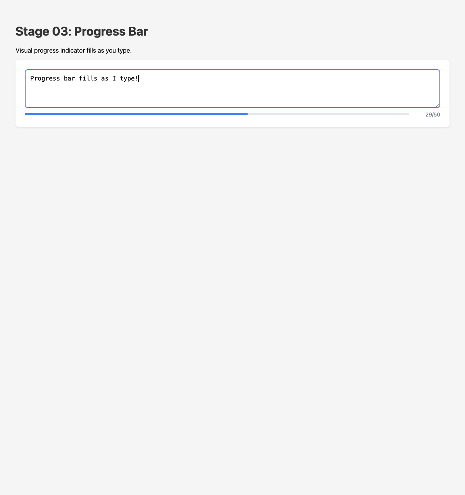
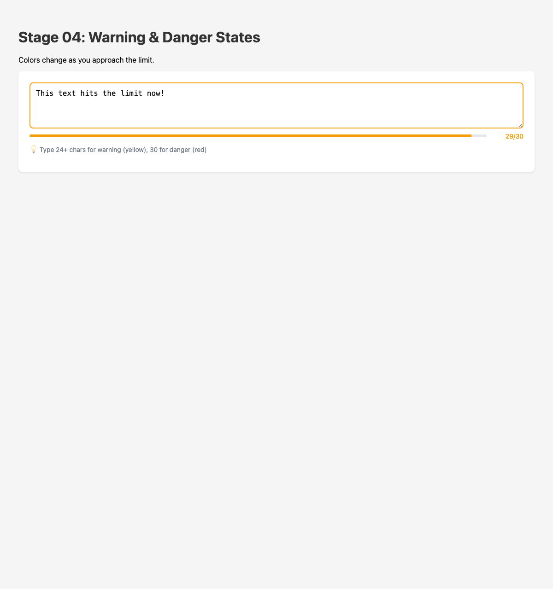

# Part I - Why & What

## The Why

Why vanilla JavaScript? Why no framework?

I've been searching for a simple, clean way to develop web components with proper testing, and what I found was disappointing: complicated toolchains, heavy test runners, transpilation steps, and mountains of configuration. The more you focus on tools, the less mental space you have for creating value.

Modern JavaScript and current browsers are incredibly powerful. They have everything we need to build production-grade, maintainable components without external dependencies. Dependencies are one of the major drawbacks of sustainable software development. The simpler we keep things, the easier they are to maintain over time and understand for new developers.

## What This Guide Covers

We'll build a real, practical web component: a **text area with character counting**. Think Twitter's compose box — it counts characters, shows progress, warns you when approaching the limit, and even saves drafts automatically.

Along the way, you'll learn:

- How to set up a minimal, modern testing environment
- Test-Driven Development with web components
- Shadow DOM and encapsulation
- Reactive state management without frameworks
- Custom attributes and properties
- Event dispatching
- CSS custom properties for theming
- Local storage persistence

## Our Constraints

Let's be explicit about what we're optimizing for:

1. **Pure vanilla JavaScript** — no transpilation, no build step for production code
2. **Visual feedback** — we're building UI, we need to see it working
3. **Fast feedback loops** — live reload, instant test results
4. **Standard testing** — proper unit tests with a real test runner
5. **Simple test patterns** — direct DOM access, no magic wrappers
6. **TDD workflow** — write tests first, watch them fail, make them pass

## The Component We're Building

Our `<rc-text-area>` component will:

- Display a textarea with a label
- Count characters in real-time
- Show a progress bar
- Change colors at 80% (warning) and 100% (danger)
- Enforce character limits
- Fire custom events
- Optionally persist to localStorage

Here's what the final result looks like:



---

# Part II - Setting Up the Environment

## Modern Tooling (2024+)

Testing web components has gotten much simpler since I first wrote about this topic. We now have excellent tools that work out of the box:

- **Web Test Runner** — runs tests in real browsers (not jsdom!)
- **Playwright** — drives the browser programmatically
- **Chai** — assertion library with a clean API
- **live-server** — simple HTTP server with auto-reload

The key insight: **test in real browsers**. Tools like Jest with jsdom simulate the DOM, but web components have quirks that only show up in real browsers. Web Test Runner solves this elegantly.

## Project Setup

Let's initialize our project:

```bash
mkdir vanillajs-webcomponents-tdd
cd vanillajs-webcomponents-tdd
npm init -y
```

Install dev dependencies:

```bash
npm install --save-dev \
  @web/test-runner \
  @web/test-runner-playwright \
  @esm-bundle/chai \
  live-server \
  concurrently
```

Create the folder structure:

```bash
mkdir -p components/text-area
touch components/text-area/text-area.js
touch components/text-area/text-area.test.js
touch components/text-area/index.html
```

## Configure package.json

Edit your `package.json` scripts:

```json
{
  "name": "vanillajs-webcomponents-tdd",
  "type": "module",
  "scripts": {
    "test": "web-test-runner \"components/**/*.test.js\" --node-resolve --playwright --browsers chromium",
    "test:watch": "npm test -- --watch",
    "dev:server": "live-server --port=3000 --no-browser",
    "dev": "concurrently -k \"npm:test:watch\" \"npm:dev:server\""
  }
}
```

Key points:

- `"type": "module"` enables ES modules natively
- `--node-resolve` handles bare imports
- `--playwright --browsers chromium` runs tests in a real Chrome browser
- `concurrently -k` runs both test watcher and dev server, killing both on exit

## Your First Run

At this point, run `npm run dev` and you should see both the test runner (waiting for tests) and the server starting up.

---

# Part III - The Walking Skeleton

## Starting with a Failing Test

TDD Rule #1: Start with a failing test. Let's write the simplest possible test — does our component exist?

Create `components/text-area/text-area.test.js`:

```javascript
/**
 * Tests for <rc-text-area/> web component
 */
import { expect } from '@esm-bundle/chai';
import './text-area.js';

describe('<rc-text-area/>', () => {

    describe('Component Registration', () => {
        it('should be registered as a custom element', () => {
            expect(customElements.get('rc-text-area')).to.exist;
        });
    });

});
```

Run the tests:

```bash
npm test
```

You'll see a failure — `rc-text-area` is not defined. Good! That's exactly what we want.

## Making the First Test Pass

Now let's write the minimal code to make this test pass.

Create `components/text-area/text-area.js`:

```javascript
/**
 * <rc-text-area/> - A text area with character counting
 */
class RcTextArea extends HTMLElement {
    constructor() {
        super();
        this.attachShadow({ mode: 'open' });
    }
}

customElements.define('rc-text-area', RcTextArea);
```

Run tests again — it passes! 🎉

But our component doesn't render anything. Let's fix that.

## Adding the Shadow DOM Template

Add a template with basic structure:

```javascript
class RcTextArea extends HTMLElement {
    constructor() {
        super();
        this.attachShadow({ mode: 'open' });
        
        this.shadowRoot.innerHTML = `
            <style>
                :host { display: block; }
                textarea { 
                    width: 100%; 
                    min-height: 100px;
                    font-size: 1rem;
                    padding: 0.5rem;
                }
            </style>
            <textarea placeholder="Type something..."></textarea>
        `;
    }
}

customElements.define('rc-text-area', RcTextArea);
```

## Visual Testing

Create `components/text-area/index.html` for visual testing:

```html
<!DOCTYPE html>
<html lang="en">
<head>
    <meta charset="UTF-8">
    <meta name="viewport" content="width=device-width, initial-scale=1.0">
    <title>Text Area Component</title>
    <style>
        body {
            font-family: -apple-system, BlinkMacSystemFont, sans-serif;
            padding: 2rem;
            background: #f5f5f5;
        }
        .demo {
            background: white;
            padding: 1.5rem;
            border-radius: 8px;
            box-shadow: 0 2px 4px rgba(0,0,0,0.1);
        }
    </style>
</head>
<body>
    <h1>Stage 01: Walking Skeleton</h1>
    <p>Our first test passes — the component exists!</p>
    
    <div class="demo">
        <rc-text-area></rc-text-area>
    </div>

    <script type="module" src="./text-area.js"></script>
</body>
</html>
```

Open http://localhost:3000/components/text-area/ in your browser:



We have a working component! It doesn't do much yet, but the foundation is solid.

---

# Part IV - Character Counting

## The Test First

Let's add character counting. First, write the tests:

```javascript
describe('<rc-text-area/>', () => {

    // Helper to create and mount a component
    const createComponent = (attrs = {}) => {
        const component = document.createElement('rc-text-area');
        for (const [key, value] of Object.entries(attrs)) {
            component.setAttribute(key, value);
        }
        document.body.appendChild(component);
        return component;
    };

    // Clean up after each test
    afterEach(() => {
        document.body.innerHTML = '';
    });

    describe('Default State', () => {
        it('should have empty value by default', () => {
            const component = createComponent();
            expect(component.value).to.equal('');
        });

        it('should have default max-chars of 280', () => {
            const component = createComponent();
            expect(component.maxChars).to.equal(280);
        });
    });

    describe('Character Counting', () => {
        it('should count characters as you type', () => {
            const component = createComponent({ 'max-chars': '100' });
            const textarea = component.shadowRoot.querySelector('textarea');
            
            textarea.value = 'Hello';
            textarea.dispatchEvent(new Event('input', { bubbles: true }));
            
            expect(component.charCount).to.equal(5);
        });

        it('should calculate remaining characters', () => {
            const component = createComponent({ 'max-chars': '100' });
            const textarea = component.shadowRoot.querySelector('textarea');
            
            textarea.value = 'Hello World';
            textarea.dispatchEvent(new Event('input', { bubbles: true }));
            
            expect(component.charsRemaining).to.equal(89);
        });
    });

});
```

Run the tests — they fail. Now let's implement.

## The Implementation

Update `text-area.js`:

```javascript
/**
 * <rc-text-area/> - A text area with character counting
 */

const template = document.createElement('template');
template.innerHTML = `
    <style>
        :host {
            display: block;
            font-family: inherit;
        }
        .container {
            display: flex;
            flex-direction: column;
            gap: 0.5rem;
        }
        textarea {
            width: 100%;
            min-height: 100px;
            font-size: 1rem;
            padding: 0.75rem;
            border: 2px solid #d1d5db;
            border-radius: 0.5rem;
            box-sizing: border-box;
            resize: vertical;
        }
        textarea:focus {
            outline: none;
            border-color: #3b82f6;
        }
        .counter {
            font-size: 0.875rem;
            color: #6b7280;
            text-align: right;
        }
    </style>
    <div class="container">
        <textarea id="textarea" placeholder="Type something..."></textarea>
        <span class="counter" id="counter">0/280</span>
    </div>
`;

class RcTextArea extends HTMLElement {
    constructor() {
        super();
        this.attachShadow({ mode: 'open' });
        this.shadowRoot.appendChild(template.content.cloneNode(true));
        
        // Cache DOM references
        this.$textarea = this.shadowRoot.querySelector('#textarea');
        this.$counter = this.shadowRoot.querySelector('#counter');
        
        // Bind event handlers
        this._handleInput = this._handleInput.bind(this);
    }

    connectedCallback() {
        this.$textarea.addEventListener('input', this._handleInput);
        this._render();
    }

    disconnectedCallback() {
        this.$textarea.removeEventListener('input', this._handleInput);
    }

    // Public API
    get value() {
        return this.$textarea.value;
    }

    set value(val) {
        this.$textarea.value = val;
        this._render();
    }

    get maxChars() {
        return parseInt(this.getAttribute('max-chars')) || 280;
    }

    get charCount() {
        return this.$textarea.value.length;
    }

    get charsRemaining() {
        return this.maxChars - this.charCount;
    }

    // Private methods
    _handleInput() {
        this._render();
    }

    _render() {
        this.$counter.textContent = `${this.charCount}/${this.maxChars}`;
    }
}

customElements.define('rc-text-area', RcTextArea);

export { RcTextArea };
```

Run tests — they pass!



Notice the pattern:
1. Write tests describing behavior
2. Run tests (see failure)
3. Implement minimal code
4. Run tests (see success)
5. Refactor if needed

---

# Part V - Visual Progress Bar

## Tests for the Progress Bar

```javascript
describe('Progress Bar', () => {
    it('should show progress percentage', () => {
        const component = createComponent({ 'max-chars': '100' });
        const textarea = component.shadowRoot.querySelector('textarea');
        const progress = component.shadowRoot.querySelector('#progress');
        
        textarea.value = 'A'.repeat(50);
        textarea.dispatchEvent(new Event('input', { bubbles: true }));
        
        expect(progress.style.width).to.equal('50%');
    });
});
```

## Adding the Progress Bar

Update the template:

```html
<div class="container">
    <textarea id="textarea" placeholder="Type something..."></textarea>
    <div class="footer">
        <div class="progress-bar">
            <div class="progress-fill" id="progress"></div>
        </div>
        <span class="counter" id="counter">0/280</span>
    </div>
</div>
```

Add styles:

```css
.footer {
    display: flex;
    justify-content: space-between;
    align-items: center;
    gap: 1rem;
}
.progress-bar {
    flex: 1;
    height: 6px;
    background: #e5e7eb;
    border-radius: 3px;
    overflow: hidden;
}
.progress-fill {
    height: 100%;
    background: #3b82f6;
    transition: width 0.15s;
    width: 0%;
}
.counter {
    font-size: 0.875rem;
    color: #6b7280;
    min-width: 4rem;
    text-align: right;
}
```

Update `_render()`:

```javascript
_render() {
    const percentage = Math.min((this.charCount / this.maxChars) * 100, 100);
    this.$counter.textContent = `${this.charCount}/${this.maxChars}`;
    this.$progress.style.width = `${percentage}%`;
}
```

Don't forget to cache the progress element in the constructor:

```javascript
this.$progress = this.shadowRoot.querySelector('#progress');
```



---

# Part VI - Warning and Danger States

## Visual Feedback at Thresholds

Users need to know when they're approaching the limit. Let's add warning (yellow at 80%) and danger (red at 100%) states.

## Tests for States

```javascript
describe('Visual States', () => {
    it('should show warning state at 80%', () => {
        const component = createComponent({ 'max-chars': '100' });
        const textarea = component.shadowRoot.querySelector('textarea');
        
        textarea.value = 'A'.repeat(80);
        textarea.dispatchEvent(new Event('input', { bubbles: true }));
        
        expect(textarea.classList.contains('warning')).to.be.true;
    });

    it('should show danger state at 100%', () => {
        const component = createComponent({ 'max-chars': '100' });
        const textarea = component.shadowRoot.querySelector('textarea');
        
        textarea.value = 'A'.repeat(100);
        textarea.dispatchEvent(new Event('input', { bubbles: true }));
        
        expect(textarea.classList.contains('danger')).to.be.true;
    });

    it('should remove warning when under 80%', () => {
        const component = createComponent({ 'max-chars': '100' });
        const textarea = component.shadowRoot.querySelector('textarea');
        
        // Go to warning
        textarea.value = 'A'.repeat(80);
        textarea.dispatchEvent(new Event('input', { bubbles: true }));
        
        // Go back under
        textarea.value = 'A'.repeat(50);
        textarea.dispatchEvent(new Event('input', { bubbles: true }));
        
        expect(textarea.classList.contains('warning')).to.be.false;
    });
});
```

## Implementing State Colors

Add CSS for states:

```css
textarea.warning { border-color: #f59e0b; }
textarea.danger { border-color: #ef4444; }

.progress-fill.warning { background: #f59e0b; }
.progress-fill.danger { background: #ef4444; }

.counter.warning { color: #f59e0b; font-weight: 500; }
.counter.danger { color: #ef4444; font-weight: 600; }
```

Update `_render()` to apply state classes:

```javascript
_render() {
    const percentage = Math.min((this.charCount / this.maxChars) * 100, 100);
    this.$counter.textContent = `${this.charCount}/${this.maxChars}`;
    this.$progress.style.width = `${percentage}%`;
    
    // Determine visual state
    let state = '';
    if (percentage >= 100) state = 'danger';
    else if (percentage >= 80) state = 'warning';
    
    // Apply state classes
    this.$textarea.classList.toggle('warning', state === 'warning');
    this.$textarea.classList.toggle('danger', state === 'danger');
    this.$progress.classList.toggle('warning', state === 'warning');
    this.$progress.classList.toggle('danger', state === 'danger');
    this.$counter.classList.toggle('warning', state === 'warning');
    this.$counter.classList.toggle('danger', state === 'danger');
}
```



---

# Part VII - Character Limit Enforcement

## Preventing Overflow

Should we let users type past the limit? For our use case, let's enforce it by truncating.

## Test

```javascript
describe('Character Limit Enforcement', () => {
    it('should truncate input exceeding max-chars', () => {
        const component = createComponent({ 'max-chars': '10' });
        const textarea = component.shadowRoot.querySelector('textarea');
        
        textarea.value = 'This is way too long';
        textarea.dispatchEvent(new Event('input', { bubbles: true }));
        
        expect(component.value).to.equal('This is wa');
        expect(component.charCount).to.equal(10);
    });
});
```

## Implementation

Update `_handleInput()`:

```javascript
_handleInput() {
    // Enforce max chars
    if (this.$textarea.value.length > this.maxChars) {
        this.$textarea.value = this.$textarea.value.slice(0, this.maxChars);
    }
    this._render();
}
```

---

# Part VIII - Custom Events

## Communicating with the Outside World

Components need to tell the outside world when things happen. Let's dispatch events.

## Tests for Events

```javascript
describe('Events', () => {
    it('should fire input event on typing', (done) => {
        const component = createComponent();
        const textarea = component.shadowRoot.querySelector('textarea');
        
        component.addEventListener('input', (e) => {
            expect(e.detail.value).to.equal('Hello');
            expect(e.detail.charCount).to.equal(5);
            done();
        });
        
        textarea.value = 'Hello';
        textarea.dispatchEvent(new Event('input', { bubbles: true }));
    });

    it('should fire limitReached when limit is hit', (done) => {
        const component = createComponent({ 'max-chars': '5' });
        const textarea = component.shadowRoot.querySelector('textarea');
        
        component.addEventListener('limitReached', (e) => {
            expect(e.detail.value).to.equal('Hello');
            expect(e.detail.maxChars).to.equal(5);
            done();
        });
        
        textarea.value = 'Hello';
        textarea.dispatchEvent(new Event('input', { bubbles: true }));
    });
});
```

## Dispatching Events

Add event dispatching to `_handleInput()`:

```javascript
_handleInput() {
    // Enforce max chars
    if (this.$textarea.value.length > this.maxChars) {
        this.$textarea.value = this.$textarea.value.slice(0, this.maxChars);
    }
    
    this._render();
    
    // Dispatch input event
    this.dispatchEvent(new CustomEvent('input', {
        detail: {
            value: this.value,
            charCount: this.charCount,
            charsRemaining: this.charsRemaining
        },
        bubbles: true
    }));
    
    // Dispatch limitReached (once)
    if (this.charCount >= this.maxChars && !this._limitReachedFired) {
        this._limitReachedFired = true;
        this.dispatchEvent(new CustomEvent('limitReached', {
            detail: {
                value: this.value,
                maxChars: this.maxChars
            },
            bubbles: true
        }));
    } else if (this.charCount < this.maxChars) {
        this._limitReachedFired = false;
    }
}
```

---

# Part IX - localStorage Persistence

## Auto-Saving Drafts

A great UX feature: save drafts automatically so users don't lose their work.

## Tests

```javascript
describe('localStorage Persistence', () => {
    afterEach(() => {
        localStorage.clear();
    });

    it('should save to localStorage when storage-key is set', (done) => {
        const component = createComponent({ 'storage-key': 'test-storage' });
        const textarea = component.shadowRoot.querySelector('textarea');
        
        textarea.value = 'Saved text';
        textarea.dispatchEvent(new Event('input', { bubbles: true }));
        
        // Wait for debounced save
        setTimeout(() => {
            expect(localStorage.getItem('test-storage')).to.equal('Saved text');
            done();
        }, 600);
    });

    it('should load from localStorage on mount', () => {
        localStorage.setItem('draft-key', 'Previously saved');
        
        const component = createComponent({ 'storage-key': 'draft-key' });
        
        expect(component.value).to.equal('Previously saved');
    });

    it('should clear localStorage when clear() is called', (done) => {
        const component = createComponent({ 'storage-key': 'test-storage' });
        const textarea = component.shadowRoot.querySelector('textarea');
        
        textarea.value = 'Some text';
        textarea.dispatchEvent(new Event('input', { bubbles: true }));
        
        setTimeout(() => {
            component.clear();
            expect(localStorage.getItem('test-storage')).to.be.null;
            expect(component.value).to.equal('');
            done();
        }, 600);
    });
});
```

## Implementation

Add storage handling:

```javascript
// In constructor
this._saveToStorage = this._debounce(this._saveToStorage.bind(this), 500);

// New methods
get storageKey() {
    return this.getAttribute('storage-key');
}

_loadFromStorage() {
    if (this.storageKey) {
        const saved = localStorage.getItem(this.storageKey);
        if (saved !== null) {
            this.$textarea.value = saved;
        }
    }
}

_saveToStorage() {
    if (this.storageKey) {
        localStorage.setItem(this.storageKey, this.value);
    }
}

_debounce(fn, delay) {
    let timeout;
    return (...args) => {
        clearTimeout(timeout);
        timeout = setTimeout(() => fn.apply(this, args), delay);
    };
}

clear() {
    this.$textarea.value = '';
    if (this.storageKey) {
        localStorage.removeItem(this.storageKey);
    }
    this._render();
}
```

Update `connectedCallback()`:

```javascript
connectedCallback() {
    this.$textarea.addEventListener('input', this._handleInput);
    this._loadFromStorage();
    this._render();
}
```

Update `_handleInput()` to trigger save:

```javascript
_handleInput() {
    // ... existing code ...
    this._saveToStorage();
}
```

---

# Part X - Label and Placeholder

## Configurable Text

Let's add support for label and placeholder attributes.

## Tests

```javascript
describe('Label and Placeholder', () => {
    it('should display label when provided', () => {
        const component = createComponent({ label: 'Your Message' });
        const label = component.shadowRoot.querySelector('#label');
        expect(label.textContent).to.equal('Your Message');
    });

    it('should set placeholder on textarea', () => {
        const component = createComponent({ placeholder: 'Type here...' });
        const textarea = component.shadowRoot.querySelector('textarea');
        expect(textarea.placeholder).to.equal('Type here...');
    });
});
```

## Implementation

Update template to include label:

```html
<div class="container">
    <label class="label" id="label"></label>
    <textarea id="textarea"></textarea>
    <div class="footer">
        <div class="progress-bar">
            <div class="progress-fill" id="progress"></div>
        </div>
        <span class="counter" id="counter">0/280</span>
    </div>
</div>
```

Add label styling:

```css
.label {
    font-size: 0.875rem;
    font-weight: 500;
    color: #374151;
    margin-bottom: 0.25rem;
}
.label:empty {
    display: none;
}
```

Add to `connectedCallback()`:

```javascript
connectedCallback() {
    this.$textarea.addEventListener('input', this._handleInput);
    
    // Set label
    this.$label = this.shadowRoot.querySelector('#label');
    this.$label.textContent = this.getAttribute('label') || '';
    
    // Set placeholder
    this.$textarea.placeholder = this.getAttribute('placeholder') || '';
    
    this._loadFromStorage();
    this._render();
}
```

---

# Part XI - Theming with CSS Custom Properties

## Making It Customizable

CSS custom properties let consumers style the component from outside.

## Adding CSS Variables

Update the styles:

```css
:host {
    display: block;
    font-family: inherit;
    
    --bg-color: white;
    --border-color: #d1d5db;
    --border-focus-color: #3b82f6;
    --text-color: #374151;
    --muted-color: #6b7280;
    --warning-color: #f59e0b;
    --danger-color: #ef4444;
    --progress-bg: #e5e7eb;
    --progress-color: #3b82f6;
}

textarea {
    background: var(--bg-color);
    border-color: var(--border-color);
    color: var(--text-color);
}

textarea:focus {
    border-color: var(--border-focus-color);
}

textarea.warning { border-color: var(--warning-color); }
textarea.danger { border-color: var(--danger-color); }

.progress-bar {
    background: var(--progress-bg);
}

.progress-fill {
    background: var(--progress-color);
}

.progress-fill.warning { background: var(--warning-color); }
.progress-fill.danger { background: var(--danger-color); }

.counter {
    color: var(--muted-color);
}

.counter.warning { color: var(--warning-color); }
.counter.danger { color: var(--danger-color); }
```

Now consumers can style the component:

```html
<style>
    rc-text-area.dark {
        --bg-color: #1f2937;
        --border-color: #4b5563;
        --text-color: #f3f4f6;
        --muted-color: #9ca3af;
    }
</style>

<rc-text-area class="dark"></rc-text-area>
```

---

# Part XII - The Complete Component

## Final Code

Here's the complete component after all our TDD iterations:

```javascript
/**
 * <rc-text-area/> - A text area with character counting
 * 
 * Attributes:
 *   - label: Label text above the textarea
 *   - placeholder: Placeholder text
 *   - max-chars: Maximum character limit (default: 280)
 *   - storage-key: localStorage key for auto-saving drafts
 * 
 * Properties:
 *   - value: Current text value
 *   - maxChars: Maximum characters allowed
 *   - charCount: Current character count
 *   - charsRemaining: Characters left until limit
 * 
 * Events:
 *   - input: Fired on every keystroke with {value, charCount, charsRemaining}
 *   - limitReached: Fired once when hitting the character limit
 * 
 * Methods:
 *   - clear(): Clears the textarea and localStorage
 *   - focus(): Focuses the textarea
 * 
 * CSS Custom Properties:
 *   - --bg-color, --border-color, --text-color, --muted-color
 *   - --warning-color, --danger-color
 *   - --progress-bg, --progress-color
 */

const template = document.createElement('template');
template.innerHTML = `
    <style>
        :host {
            display: block;
            font-family: inherit;
            --bg-color: white;
            --border-color: #d1d5db;
            --border-focus-color: #3b82f6;
            --text-color: #374151;
            --muted-color: #6b7280;
            --warning-color: #f59e0b;
            --danger-color: #ef4444;
            --progress-bg: #e5e7eb;
            --progress-color: #3b82f6;
        }
        .container {
            display: flex;
            flex-direction: column;
            gap: 0.5rem;
        }
        .label {
            font-size: 0.875rem;
            font-weight: 500;
            color: var(--text-color);
        }
        .label:empty { display: none; }
        textarea {
            width: 100%;
            min-height: 100px;
            font-size: 1rem;
            font-family: inherit;
            padding: 0.75rem;
            border: 2px solid var(--border-color);
            border-radius: 0.5rem;
            box-sizing: border-box;
            resize: vertical;
            background: var(--bg-color);
            color: var(--text-color);
            transition: border-color 0.2s;
        }
        textarea:focus {
            outline: none;
            border-color: var(--border-focus-color);
        }
        textarea.warning { border-color: var(--warning-color); }
        textarea.danger { border-color: var(--danger-color); }
        .footer {
            display: flex;
            justify-content: space-between;
            align-items: center;
            gap: 1rem;
        }
        .progress-bar {
            flex: 1;
            height: 6px;
            background: var(--progress-bg);
            border-radius: 3px;
            overflow: hidden;
        }
        .progress-fill {
            height: 100%;
            background: var(--progress-color);
            border-radius: 3px;
            transition: width 0.15s ease-out, background-color 0.2s;
            width: 0%;
        }
        .progress-fill.warning { background: var(--warning-color); }
        .progress-fill.danger { background: var(--danger-color); }
        .counter {
            font-size: 0.875rem;
            color: var(--muted-color);
            min-width: 4rem;
            text-align: right;
            transition: color 0.2s;
        }
        .counter.warning { color: var(--warning-color); font-weight: 500; }
        .counter.danger { color: var(--danger-color); font-weight: 600; }
    </style>
    <div class="container">
        <label class="label" id="label"></label>
        <textarea id="textarea"></textarea>
        <div class="footer">
            <div class="progress-bar">
                <div class="progress-fill" id="progress"></div>
            </div>
            <span class="counter" id="counter">0/280</span>
        </div>
    </div>
`;

class RcTextArea extends HTMLElement {
    constructor() {
        super();
        this.attachShadow({ mode: 'open' });
        this.shadowRoot.appendChild(template.content.cloneNode(true));
        
        this.$textarea = this.shadowRoot.querySelector('#textarea');
        this.$counter = this.shadowRoot.querySelector('#counter');
        this.$progress = this.shadowRoot.querySelector('#progress');
        this.$label = this.shadowRoot.querySelector('#label');
        
        this._limitReachedFired = false;
        this._handleInput = this._handleInput.bind(this);
        this._saveToStorage = this._debounce(this._saveToStorage.bind(this), 500);
    }

    connectedCallback() {
        this.$textarea.addEventListener('input', this._handleInput);
        this.$label.textContent = this.getAttribute('label') || '';
        this.$textarea.placeholder = this.getAttribute('placeholder') || '';
        this._loadFromStorage();
        this._render();
    }

    disconnectedCallback() {
        this.$textarea.removeEventListener('input', this._handleInput);
    }

    // Public Properties
    get value() { return this.$textarea.value; }
    set value(val) {
        this.$textarea.value = val;
        this._render();
    }

    get maxChars() { return parseInt(this.getAttribute('max-chars')) || 280; }
    get charCount() { return this.$textarea.value.length; }
    get charsRemaining() { return this.maxChars - this.charCount; }
    get storageKey() { return this.getAttribute('storage-key'); }

    // Public Methods
    clear() {
        this.$textarea.value = '';
        if (this.storageKey) localStorage.removeItem(this.storageKey);
        this._limitReachedFired = false;
        this._render();
    }

    focus() {
        this.$textarea.focus();
    }

    // Private Methods
    _handleInput() {
        if (this.$textarea.value.length > this.maxChars) {
            this.$textarea.value = this.$textarea.value.slice(0, this.maxChars);
        }
        
        this._render();
        this._saveToStorage();
        
        this.dispatchEvent(new CustomEvent('input', {
            detail: {
                value: this.value,
                charCount: this.charCount,
                charsRemaining: this.charsRemaining
            },
            bubbles: true
        }));
        
        if (this.charCount >= this.maxChars && !this._limitReachedFired) {
            this._limitReachedFired = true;
            this.dispatchEvent(new CustomEvent('limitReached', {
                detail: { value: this.value, maxChars: this.maxChars },
                bubbles: true
            }));
        } else if (this.charCount < this.maxChars) {
            this._limitReachedFired = false;
        }
    }

    _render() {
        const percentage = Math.min((this.charCount / this.maxChars) * 100, 100);
        this.$counter.textContent = `${this.charCount}/${this.maxChars}`;
        this.$progress.style.width = `${percentage}%`;
        
        let state = '';
        if (percentage >= 100) state = 'danger';
        else if (percentage >= 80) state = 'warning';
        
        ['warning', 'danger'].forEach(s => {
            const active = s === state;
            this.$textarea.classList.toggle(s, active);
            this.$progress.classList.toggle(s, active);
            this.$counter.classList.toggle(s, active);
        });
    }

    _loadFromStorage() {
        if (this.storageKey) {
            const saved = localStorage.getItem(this.storageKey);
            if (saved !== null) this.$textarea.value = saved;
        }
    }

    _saveToStorage() {
        if (this.storageKey) {
            localStorage.setItem(this.storageKey, this.value);
        }
    }

    _debounce(fn, delay) {
        let timeout;
        return (...args) => {
            clearTimeout(timeout);
            timeout = setTimeout(() => fn.apply(this, args), delay);
        };
    }
}

customElements.define('rc-text-area', RcTextArea);

export { RcTextArea };
```

---

# Part XIII - Lessons Learned

## What TDD Gave Us

1. **Confidence** — Every feature has tests. Refactoring is safe.
2. **Documentation** — Tests describe what the component does.
3. **Design pressure** — TDD pushed us toward a clean API.
4. **Incremental progress** — Small steps, always working code.

## Web Component Patterns

1. **Use templates** — Clone instead of parsing HTML repeatedly.
2. **Cache DOM references** — Query once in constructor.
3. **Bind event handlers** — Preserve `this` context.
4. **Clean up in disconnectedCallback** — Remove event listeners.
5. **Use CSS custom properties** — Enable external styling.

## Modern Testing

1. **Test in real browsers** — Web Test Runner + Playwright.
2. **ES modules everywhere** — No transpilation needed.
3. **Keep tests close to code** — Same folder, `.test.js` suffix.

---

# Part XIV - Going Further

## Ideas to Explore

- **Accessibility** — Add ARIA attributes, keyboard navigation
- **Form integration** — Participate in form submission with ElementInternals
- **Rich text** — Replace textarea with contenteditable
- **Mentions** — @ mentions with autocomplete
- **Media attachments** — Image/file upload support

## Resources

- [MDN Web Components Guide](https://developer.mozilla.org/en-US/docs/Web/API/Web_components)
- [Web Test Runner](https://modern-web.dev/docs/test-runner/overview/)
- [Open Web Components](https://open-wc.org/)
- [Custom Elements Everywhere](https://custom-elements-everywhere.com/)

---

# Conclusion

We've built a production-ready web component using nothing but vanilla JavaScript and modern browser APIs. No framework, no build step for production code, just clean, testable, maintainable code.

The TDD workflow kept us honest — every feature started as a failing test. The result is a component that's well-documented (by its tests), reliable (verified behavior), and easy to maintain (clear structure).

Web components are the future of reusable UI. They work everywhere, last forever, and don't require you to buy into any particular framework's worldview. Combined with TDD, you get components that are both durable and trustworthy.

Now go build something!

---

*Rui Carvalho — @rhwy — 2024*
