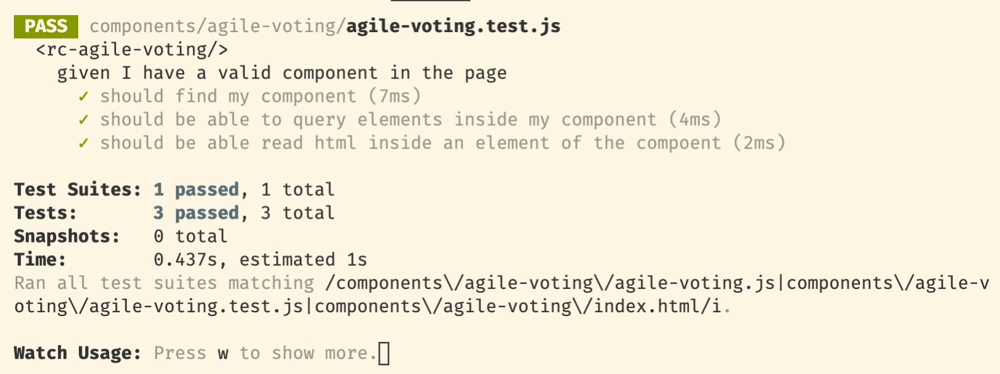
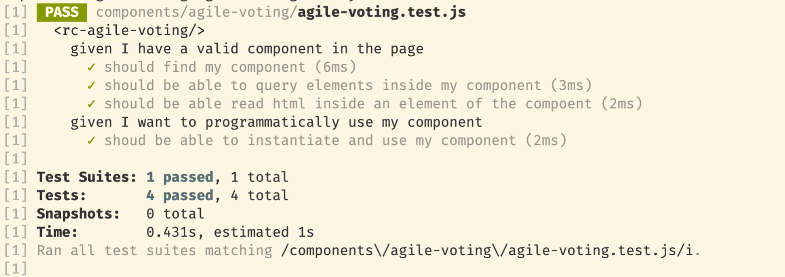
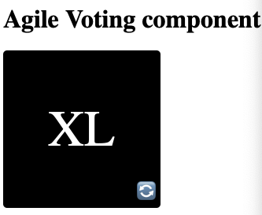
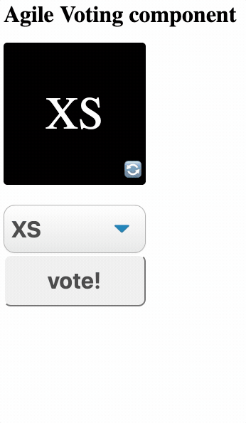
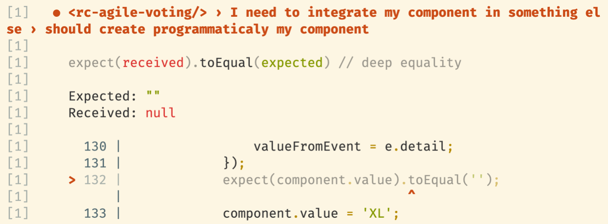
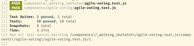
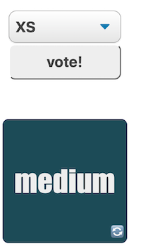
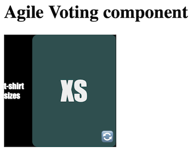
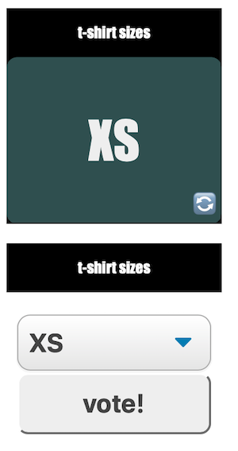

# Part I - Why & What

Always start with the why. Why are we doing this ? Mainly because I didn't found this information online as I expected to found. Instead I found a lot of complicated stuff, with complicated toolchain, test runners and so on.

The more you focus on the tools, the less you have your mind openned for creating value.

## What is this about ?

You can find around, the basics of creating a web component in vanilla js. I'm truly convinced, that today's javascript and actual browsers have enough power inside to develop sustainable solid components without any help of external dependencies. Dependencies is one of the major drawbacks of sustainable software development. The simpler we'll be able to keep things, the easier it will be to maintain in time or keep it understandable for a new developer. 

That said, we're not only using frameworks for the most evident benefit but also for the tooling and doing things in vanillajs can seem awkward especially around this tooling topic. When you see "how simple" it is to start working in javacript nowadays you may feel that it's quite impossible to do build production grade stuff without a complicated toolbox … but that's what we're trying to achieve here ;).

Please keep in mind what our focus will be, I'll put some numbers on these constraints for further reference:

1. keep vanillajs all the way long because we don't want to add complexity about transpiling code In this context. 
2. we need to be able to see the web components in action. This is UI stuff after all and whatever the unit tests you make, you need to be able to see if what you see is what you expected (WYSIWYE)
3. as much everything around dev, the shorter feedback loop when developping the better, that's why we'll need to have live synchronisation with our test pages and the browser
4. In order to keep things sane over time, we'll want to have unit tests, so we need to be able to test our components in a standard way with a test runner. 
5. The way we unit test our components need to be direct and simple (no wrappers around web components to do magic stuff around)
6. Our most common workflow is to design with TDD, our toolchain must include a way to watch for file changes and run tests given us a very quick feedback of what should be the next step. 

## What we are building ?

In order to ensure that our toolchain is good enough I would like to be able to :

* test presence/selection of a web component in a page
* test creation a web component programmatically
* test set/get of properties
* test change state on a click (or whatever standard html event)
* test throw of events from web component.
* test visibility of parts of my web component. 

We'll start building a first very simple fake component to ensure that our toolchain is good enough and then we'll build a real component in the next parts. 

To test all these things with a real component, we'll build what I should call an "agile voting component":

* it will include 2 states : not yet voted and voted.
* when not yet voted it should show:
	* a list with t-shirt size values by default ( `XS,S, M, L, XL`)
	* something to set the vote
* when voted, it should show:
	* a big text with the selected value
	* something to remove the vote and be able to vote again. 
* The values in the combo could be defined outside our component
* The outside world need to be informed when the value change


## State of the art

At this point, you should ask if all this is not some Yak shaving activity because all this should be well documented somewhere with a clear state of the art, right ??? 
Well, no. This seems to be still too recent at the moment of writing these lines to have a clear state of the art of TDD web components in a simple way…
I tried many things in order to find the best testing toolchain that fits my needs:

* Cypress
* Showroom
* Web component tester (WCT) 
* Mocha
* Jest
* other stuff (that I just read about but not convenient)

Most of the time, you need a combination of many things:  at least a test runner and something that allows you to put your web component in a context (let's say in a page in a browser) in order to get  a living DOM where you can run your component for real. Showroom and WCT have been created exactly for that but they didn't match my expectations : not enough stable, lack of documentation, wrapper around the component that not allow simple and natural testing of an HTMLElement, complicated configuration, complicated pipeline etc …

I end up with a functional and very simple pipeline with `Jest` + `Jsdom` . 

Jest is a well known test runner and Jsdom is virtual DOM in pure javascript that allow you to host your web component programmatically. It took sometime to find the right configuration because the version of jsdom embedded actually in Jest is not compatible with web components … 

For visual testing, I use a simple `live-server`  that refreshes the browser on each change and is really good enough for most cases. 

While trying to complete my toolchain, I also configured javascript debug in vscode for my tests. It's not mandatory but can be a good help when silly things happened. 


## Initialize all the pipeline

First step, create and initialize :

```bash
mkdir HowToCreateWebcomponents
cd HowToCreateWebcomponents
git init
# or copy your usual gitignore for web dev
echo node_modules > .gitignore  	
# answer what you want, it's not very relevant here			
npm init 							
npm install --save-dev jest jest-environment-jsdom-sixteen 
npm install --save-dev jsdom jsdom-global
# this is the common place for all our web components
mkdir components					
# this is folder for the web component we'll be working onmkdir components/agile-voting    
cd components/agile-voting 
# this is our host file for visual testing
touch index.html 		
# this is the file for our component			
touch agile-voting.js		
# this is the file that host the tests for our component		
touch agile-voting.test.js		
 
```

If you  don't have it installed, I recommend install globally `live-server` (browser-sync works fine too)
`npm install  -g live-server`

[optional] You can also install `concurrently` this allows you to run multiple node scripts in one command which have the advantage to simplify the run of our unit tests + visual tests but also to minimize the amount of shells opened:
`npm install --save-dev concurrently`

Then to finish our initialization, we'll just have to edit the `scripts` sections of our `package.json` file accordingly:

```json
 "scripts": {
    "test": "jest components/**/*.test.js --watch",
    "dev" : "concurrently --kill-others \"live-server\" \"npm run test\" "
  }
```
This means that our natural workflow will be to run `npm run dev`. By doing that it will continuously run our tests and refresh our test page on every change. 

The most important thing at the end, is to define the test environment for Jest. In our case, we use a specific package `jest-environment-jsdom-sixteen` that wraps up `jsdom` 16.x (the one that supports `customElements` and most of the things we'll need) with Jest. The simplest way to do that is to add a Jest property directly in our `package.json`:

```json
    "jest": {
        "testEnvironment": "jest-environment-jsdom-sixteen"
    }

```

At this point, you can now run the `dev` command and have the expected dev toolchain:


## Ensure workflow correctness with a failing test!
This is just a walking skeleton test to ensure everything works as expected, write in your `agile-voting.tests.js` file :  
(Comments inside for simplicity)

```js
//this will load our production code (here we'll have only one function)
const bigquestion = require('./agile-voting.js');

//we use to define the name of our component as top level descriptor of our test suite:
describe('<rc-agile-voting/>', () => {

	//then we start defining our scenarios:
	describe('given I have a big question', () => {

		  //with our individual tests inside :
        it('should return 42', () => {
			  //this is the Jest matchers, the syntax for expressing what we are testing
			  // [expect] wraps up the SUT (system under test)
			  // [toEqual] is the matcher we're using here:
			  //  "we expect that the result of bigquestion() is equal to 42" 	
            expect(bigquestion()).toEqual(42);
        })
    });
});
```

As our watcher is running, we immediately get this, giving us the necessary feedback :


Let's turn this failing test into green!
Open `agile-voting.js` and just add this:

```js
module.exports = () =>  42
```

Which should quickly solve our test as expected : 


We have now a full working test pipeline, we can go on now and test DOM stuff.


# Part II - Ensure everything is working and testable for web components

This is the part where we're finishing our setup and ensure we can manipulate the dom, create web components and be able to test them

## First Test with the DOM
This is an important part, in order to be able to test and work with web components we need to simulate the way of working of a page in a browser (or test within a real environment like a browser).

In order to work (and learn) with baby steps, we'll make the following steps:

* write a test that look for the web component `rc-agile-voting`
* create a minimal html content within our `index.html`file  with our web component (as the web component do not exist yet, it will be considered as a `HTMLUnknownElement` but still valid enough for testing)
* load the html content in our test file and inject it in current test document (it works thanks to the JSDOM used by Jest)
* query the DOM to look for our component and ensure it is found.

So, start with the test suite setup and the first test:

```js
//load node libraries to be able to read files content
const fs = require('fs');
const path = require('path');
//load the html content of our test host document 
const html = fs.readFileSync(path.resolve(__dirname, 'index.html'), 'utf8');
 
//start our test suite
describe('<rc-agile-voting/>', () => {

    //setup the test suite:
    //before each test run fill the current test document with the content
    //of our test document
    beforeEach(() => {
        document.documentElement.innerHTML = html.toString();
    });
  
    //start our scenario:
    describe('given I have a valid component in the page', () => {
        //first try to find the compoent in the document
        it('should find my component', () => {
            const component = document.querySelector('rc-agile-voting');
            expect(component).not.toBeNull();
        })
    });
});
```

This will fail obviously. Add now this to your `index.html`file:

```html
<html>
<head>
    <meta charset="UTF-8">
</head>
<body>
  <h1>Fake component for a first unit test</h1>
<rc-agile-voting>
    <span class="value">XL</span>
</rc-agile-voting>
</body>
</html>
```


Your test should pass now, which means that we can work with the DOM. 
We'll add 2 more tests to ensure that can also work within a DOM element, this is the final version:

```js
//load node libraries to be able to read files content
const fs = require('fs');
const path = require('path');
//load the html content of our test host document 
const html = fs.readFileSync(path.resolve(__dirname, 'index.html'), 'utf8');
//I use to add some sugar for repetitive task as selecting elements (we'll see later why):
const select = (comp,name) => comp.querySelector(name);


//start our test suite
describe('<rc-agile-voting/>', () => {

    //setup the test suite:
    //before each test run fill the current test document with the content
    //of our test document
    beforeEach(() => {
        document.documentElement.innerHTML = html.toString();
    });
  
    //start our scenario:
    describe('given I have a valid component in the page', () => {
        //first try to find the compoent in the document
        it('should find my component', () => {
            const component = document.querySelector('rc-agile-voting');
            expect(component).not.toBeNull();
        })

        //then considering you can load the component, try to query elements inside
        it('should be able to query elements inside my component', () => {
            const component = document.querySelector('rc-agile-voting');
            const valueElement = component.querySelector('.value');
            expect(valueElement).toBeDefined();
            expect(valueElement.innerHTML).toEqual('XL')
        })

        //then finally try to read value inside
        it('should be able read html inside an element of the compoent', () => {
            const component = document.querySelector('rc-agile-voting');
            const valueElement = component.querySelector('.value');
            const valueContent = valueElement.innerHTML;
            expect(valueContent).toEqual('XL')
        })
    });
});

```

Everything is ok now:




## Create now a empty version of our real component

As we saw previously this is working actually because HTML accepts unknown elements as an HTMLUnknownElement (wich is basically just a `div`). We need now a real web component to start working and ensure our workflow is ready for real work!

First change the HTML with a real one using the web component from the js component file:

```html
<html>
<head>
    <meta charset="UTF-8">
</head>
<body>
    <h1>Fake component for a first unit test</h1>
    <rc-agile-voting/>
    <script src="agile-voting.js"></script>
</body>
</html>
```

Your test suite is now failing.

Open your `agile-voting.js` file and add the minimal content of our component:

```js
(function(){
    //this is a log shortcut I use to activate only when needed
    //when you have a doubt about loading, uncomment the console.log
    //otherwise it will do nothing but the rest of the code don't need
    //to be changed ;)
    const log = (info) => {
        //console.log(info);
    }; 
    //create the template for our compotent
    const template = document.createElement('template');
    template.innerHTML = `
    <style>
        .value {
            font-size: 2em;
        }
    </style>
    
    <div id="main">
        <span class="value">XL</span>
    <div>`;

  //define the component class from HTMLElement inheritance
  class AgileVoting extends HTMLElement {
        constructor()
        {
            super(); //always call parent constructor
            //attach template to shadow root
            this.attachShadow({mode:'open'});
            this.shadowRoot.appendChild(template.content.cloneNode(true));
            log('AgileVoting component instantiated')
        }

        connectedCallback(){
            //nothing for now but it's where you do the main stuff after
            //component is initialized and loaded into the document
            log('AgileVoting component loaded into the page')
        }
    }
    //register the component into the customElements list of the page
    customElements.define('rc-agile-voting',AgileVoting);
    log('rc-agile-voting defined in custom elements');

})();

```

We have now the necessary minimal component structure but our tests are still failing

We need to complete our tests with 2 things:

1. Load the web component from the js file (the component is not recognized even with the `<script>` tag of the page, this is because we are injecting the html content of the page and not doing a regular load - I suppose but feedback is welcomed ;)).
2. Change the selector to use the `shadowRoot` instead of the element itself.

Within your test file, add this line for the first point (after html loading):

```js
const AgileVoting = require('./agile-voting.js');
```

And change the selector helper to this version:

```js
const select = (comp,name)  => comp.shadowRoot.querySelector(name);
```

Your tests are now passing again.


## Use the component programmatically

Most of the times you won't play directly with a web component but use it within other components, so you also need to be able to work with it programmatically. This mainly means that you need to be able to instantiate the webcomponent class instead of loading the component through the DOM.

Let's add a new scenario with a simple test for that:
_(Add this at the end of our test suite)_

```js
 describe('given I want to programmatically use my component', () => {
        it('shoud be able to instantiate and use my component', () => {
            const component = new AgileVoting();
            expect(component).toBeDefined();
        })
    });
```

This will fail even if we add everything in place because even if our component is valid for html use, we need to expose the component from a module in order to be able to load it. 
You just need to add a line to export at the end of the javascript file of the module:

```js
    try {
        //do this in a try catch because module is not supported 
        //when loaded as is on a page
        //export the component in order to be able to use it
        // programmatically in js
        module.exports = AgileVoting; 
    } catch {}
```

_Note also that we added a few lines around to avoid `module` throwing error in the console when viewing the html page._

Now your tests are complete and green!



The setup is now quite complete  and you can stop here if you want to start building your own stuff. We'll see a few additional things while building our final component in the next part. 


# Part III -  Basic design of our component

## start with visual feedback

In this part, as we have now everything in place, I'll want to share what is my development workflow for this kind of things.

As we already have a working skeleton of the component, I would start by some design in order to feel better how to present and work with my component and before investing too much time in more complicated stuff.  For that I have my index.html page for my component opened and refreshed for every change via `live-server` as explained in the setup : I use `npm run dev` which start the live-server along my unit tests. 

In the beginning we set that we should have 2 states: one with the selection+set of the value and one with the selected value + reset.

As I work in baby steps, the simplest view is second : once I have a valid value (that I'll write in stone for now) I just have to show this value along with a reset button. I spike a little in real time to find a good enough shape and end up with this: 



Which corresponds to the following code:

```js
const template = document.createElement('template');
    template.innerHTML = `
    <style>
        :host {
            position:relative;
            display:flex;
            justify-content : center;
            align-items : center;
            width : 200px;
            height : 200px;
            background-color: black;
            color : white;
            border-radius : 5px;
        }
        #value {
            font-size: 4em;
        }
        #reset {
            font-size:1.5em;
            display:block;
            position:absolute;
            bottom:5px;
            right:5px;
            z-index:50;
        }
    </style>
    
    <div id="main">
        <span id="value">XL</span>
        <span id="reset">🔄</span>
    <div>`;
```

Once that, we can see the necessity of having a "vote value" property in our component, this will allow us to:

* store the selected value
* define what to show depending on if this value is defined or not.

First,  as I also want to have a visual feedback, I'll have 2 components in my index.html page of the component, one with the value set and one with the value not set. This will also allow me to visualize that the two different states are shown correctly.

So, this will be the first step, I'll update the html:

```html
<html>
<head>
    <meta charset="UTF-8">
</head>
<body>
    <h1>Agile Voting component</h1>

    <rc-agile-voting id="with-value-set" value="XS">
    </rc-agile-voting>

    <rc-agile-voting id="with-value-not-set">
    </rc-agile-voting>
    
    <script src="agile-voting.js"></script>
</body>
</html>
```

At this point, we'll see this:


## Then start TDDing  :  work the "value" of the component

This lead us to the following test (remove everything we done before and start with this new version):

```js
/* 
*  <rc-agile-voting/> component tests
*  (c) 2020 Rui Carvalho
*/
//load node libraries to be able to read files content
const fs = require('fs');
const path = require('path');
//load the html content of our test host document 
const html = fs.readFileSync(path.resolve(__dirname, 'index.html'), 'utf8');
const AgileVoting = require('./agile-voting.js');
const select = (comp,name) => comp.shadowRoot.querySelector(name);

//start our test suite
describe('<rc-agile-voting/>', () => {

    //setup the test suite:
    //before each test run fill the current test document with the content
    //of our test document
    beforeEach(() => {
        document.documentElement.innerHTML = html.toString();
    });
   
    //start our scenario:
    describe('given I have a component with valid value', () => {
        //first try to find the component in the document
        it('should find my component', () => {
            const component = document.querySelector('#with-value-set');
            expect(component).not.toBeNull();
        })

        it('should have value set', () => {
            const component = document.querySelector('#with-value-set');
            expect(component.Value).toEqual('XS');
        })

    });
});
```

The first test pass obviously, but the second not. This will forces us to define a `Value` property within our component. In order to do that we'll need at least 2 things:

1. "define" the attribute during the connected callback
2. expose getter/setter for this attribute

```js
connectedCallback(){
    log('AgileVoting component loaded into the page');
	  //kind of "create" the attribute
    if(!this.hasAttribute('value')){
        this.setAttribute('value','');
    }
}
//define our "value" as an attribute to observe changes
static get observedAttributes() {
   return ['value',];
}
//getter
get value() {
    return this.getAttribute('value');
}
//setter
set value(newValue) {
    this.setAttribute('value', newValue);
}
```

Our tests are passing, then git add/commit.

Now, we would like to see in the Html any value we'll set and not the default constant we put:

_(we actually see the `XL` set in our component's template and not the `XS` value we set as attribute in our index.html page)_

```js 
it('should show value set in html', () => {
    const component = document.querySelector('#with-value-set');
    const elementValue = select(component, "#value");
    expect(elementValue.innerHTML).toEqual('XS');
})
```
(which fails)

First, the good practice is to identify the elements of the shadow dom we need to interact with:

```js
this.$valueInfo = this.shadowRoot.querySelector('#value')'
```

As we're catching the value of the component written in the page, we need to set that in the `connectedCallback`:

```js
this.$valueInfo.innerHTML = this.value;
```

This allows us to pass our last test. But we need to also make it available when the set is done programmatically:

```js
it('should show value set programmatically', () => {
  const component = document.querySelector('#with-value-set');
  component.value = 'M';           
  const elementValue = select(component, "#value");
  expect(elementValue.innerHTML).toEqual('M');
})
```

Which will be solve by setting the html during the set of the value:

```js
set value(newValue) {
   this.setAttribute('value', newValue);
   this.$valueInfo.innerHTML = this.value;
}
```

At this point our tests are all passing again. Let's see if we need some refactoring:

* we have a duplicate set of the value within the html content
* the good option is usually to create a `render()` function to summarize the changes and call it in a simple way every time needed.

Which leads us to this version of our component

```js
class AgileVoting extends HTMLElement {
    constructor()
    {
        super(); //always call parent constructor
        //attach template to shadow root
        this.attachShadow({mode:'open'});
        this.render = this.render.bind(this);
        this.shadowRoot.appendChild(template.content.cloneNode(true));
        this.$valueInfo = this.shadowRoot.querySelector('#value');
        log('AgileVoting component instantiated');    
    }

    connectedCallback(){
        log('AgileVoting component loaded into the page');       
		  if(!this.hasAttribute('value'){
            this.setAttribute('value','');
        }
        this.render();
    }
    static get observedAttributes() {
        return ['value'];
    }
    
    get value() {
        return this.getAttribute('value')
    }
    set value(newValue) {
        this.setAttribute('value',newValue);
        this.render();
    }

    render()
    {
        this.$valueInfo.innerHTML = this.value;
    }
}
```

Please note that we did our set html value in a function called render but that to work, we need to bind the function the instance of the class, this is achieved through the line `this.render = this.render.bind(this)` in the constructor. We'll need to do that to all shared functions that need to interact with internal state of the instance.


## Manage the reset

Now that we took care of the value, let's attack the reset button (the little icon `🔄`):

```js
it('should reset value when icon clicked', () => {
	const component = document.querySelector('#with-value-set');
  const buttonReset = select(component, '#reset');
  buttonReset.click();
  expect(component.value).toEqual('');
})
```

Which can be achieved by:

* create a reset function 
  
```js
resetValue()
{
    this.value = '';
}
```

* bind the function to instance and define internal member for button element(in constructor):
  
```js
this.resetValue = this.resetValue.bind(this);
this.$buttonReset = this.shadowRoot.querySelector('#reset');
```

* attach an event listener to the `click` of this element (in the connectedCallback):

```js
this.$buttonReset.addEventListener('click',this.resetValue);
```

Now, everything is green again. 

### Finally, manage the different views

The next thing the code is telling us to do now is to differentiate the 2 views as we have now a way to switch from one to other with the reset button:

```js
it('should switch views when icon clicked', () => {
        const component = document.querySelector('#with-value-set');
        const buttonReset = select(component, '#reset');
        const infoView = select(component,'#info');
        const formView = select(component, '#form');
        buttonReset.click();
        expect(formView.style.display).not.toEqual('none');
        expect(infoView.style.display).toEqual('none');    
 });
```

First to fix this, we'll have to update our html to reflect the "2 views" :

_(just put "form" inside our form to identify the view)_

```html
<div id="form">
    form
</div>
<div id="info">
		<span id="value"></span>
      <span id="reset">🔄</span>
<div>
```

In constructor, we'll need to identify our 2 forms and bind a function that will be used to make the switch:

```js
this.ensureFormShownIfNoValueSet = this.ensureFormShownIfNoValueSet.bind(this);
this.$formView = this.shadowRoot.querySelector('#form');
this.$infoView = this.shadowRoot.querySelector('#info');
```

And our switch function:

```js
ensureFormShownIfNoValueSet()
{
    if(this.value != '')
    {
        this.$infoView.style.display = 'flex';
        this.$formView.style.display = 'none';
    } else {
        this.$infoView.style.display = 'none';
        this.$formView.style.display = 'flex';
    }
}
```

It's ok for now, we can check visually that's ok and our tests are green.


# Part IV - TDDing the form view

## Start with visual feedback

As usual, I try to get visual feedback about what should be a good enough shape of my html. One could say to start by implementing features and throw this at the end but this is about user experience. Here I would like to start with a combo+button, but depending on what I can test visually, I can decide that this pair of elements are not the good ones and this has impact on my future implementation. 

So, I ended up with the following html:

```html
<div id="form">
   <select id="selector">
       <option id="xs">XS</option>
       <option id="s">S</option>
       <option id="m">M</option>
       <option id="l">L</option>
       <option id="xl">XL</option>
   </select>
   <button id="setValue">vote!</button>
</div>
```

And css:
```css
#form {
    background-color : white;
    width:100%;
    height:100%;
    display:flex;
    flex-direction:column;
    justify-content : center;
    align-items : center;
}
#selector {
    display: block;
    font-size: 2em;
    font-weight: 700;
    color: #444;
    line-height: 2em;
    outline:none;
    box-sizing: border-box;
    width: 100%;
    max-width: 100%;
    margin: 0;
    padding:1px 10px 1px 10px;
    border: 1px solid #aaa;
    box-shadow: 0 1px 0 1px rgba(0,0,0,.04);
    border-radius: .5em;
    -moz-appearance: none;
    -webkit-appearance: none;
    appearance: none;
    background-color: #fff;
    background-image: url('data:image/svg+xml;charset=US-ASCII,%3Csvg%20xmlns%3D%22http%3A%2F%2Fwww.w3.org%2F2000%2Fsvg%22%20width%3D%22292.4%22%20height%3D%22292.4%22%3E%3Cpath%20fill%3D%22%23007CB2%22%20d%3D%22M287%2069.4a17.6%2017.6%200%200%200-13-5.4H18.4c-5%200-9.3%201.8-12.9%205.4A17.6%2017.6%200%200%200%200%2082.2c0%205%201.8%209.3%205.4%2012.9l128%20127.9c3.6%203.6%207.8%205.4%2012.8%205.4s9.2-1.8%2012.8-5.4L287%2095c3.5-3.5%205.4-7.8%205.4-12.8%200-5-1.9-9.2-5.5-12.8z%22%2F%3E%3C%2Fsvg%3E'),
        linear-gradient(to bottom, #ffffff 0%,#e5e5e5 100%);
    background-repeat: no-repeat, repeat;
    background-position: right .7em top 50%, 0 0;
    background-size: 0.65em auto, 100%;
} 

#setValue {
    width:100%;
    border-radius : 10px;
    background-color:#EEE;
    box-sizing: border-box;
    text-align:center;
            transition: all 0.2s;
    font-size: 2em;
    font-weight: 700;
    color: #444;
    line-height: 2em;
    outline:none;
    
}
#setValue:hover {
    background-color:#4eb5f1;
}
```


Note :  _As it's not the purpose of this article, I took most of the select styling from this article [Styling a Select Like It's 2019 | Filament Group, Inc.](https://www.filamentgroup.com/lab/select-css.html). Nothing special, but I didn't want here to re-invent by my self the arrow svg in css background to mimic the default select aspect_

Whatever it's ok or not, at this point it's good enough in terms of user experience



First, now that I got visual feedback of what it should looks like, I would like to materialize

```js
it('should show form view when no value set', () => {
    const component = document.querySelector('#with-value-not-set');
    const infoView = select(component,'#info');
    const formView = select(component, '#form');
    expect(component.value).toEqual('');
    expect(formView.style.display).not.toEqual('none');
    expect(infoView.style.display).toEqual('none'); 
    
})
it('should show elements to select value',() => {
    const component = document.querySelector('#with-value-not-set');
    const comboSelector = select(component, '#selector');
    const buttonSet = select(component, '#setValue');
    expect(comboSelector).not.toBeNull();  
    expect(buttonSet).not.toBeNull();   
});

```

basically, when select our version of the component  where the value is not set, we're testing that we show the form view and that the combo + button are present. 

some comments:

* in this kind of tests that are written after implementation, it's important to still have a failing test, so, for exemple start testing the opposite of the expected `expect(infoView.style.display).not.toEqual('none');`  (note the `not` here) before writing the correct assumption `expect(infoView.style.display).toEqual('none');`
* here we test that the value is not set by comparing value to an empty string (and not `null`or `undefined` because the value is stored in an html attribute that always have a value of a string

## Then add some functionality

Now that we have a valid interface, we just have to define the set function on button click after select with a new test:
```js
it('it sets the value on the component',() => {
   const component = document.querySelector('#with-value-not-set');
   const comboSelector = select(component, '#selector');
   const buttonSet = select(component, '#setValue');
   comboSelector.value = 'M';
   buttonSet.click();
   expect(component.value).toEqual('M');
})
```

the implementation is quite the same as we did for our reset button:

* extract elements to variables (constructor):
  
```js
this.$combo = this.shadowRoot.querySelector('#selector');
this.$buttonSet = this.shadowRoot.querySelector('setValue');
```           

* create a set function:
  
```js
setValueFromCombo()
{
    this.value = this.$combo.value;
}
```

* bind the function to the instance (constructor):
  
```js
this.setValueFromCombo = this.setValueFromCombo.bind(this);
```

* attach an event listener to the button click to execute the function (connectedCallback):
  
```js
this.$buttonSet.addEventListener('click',this.setValueFromCombo);
```

… and that's all !

For sanity, I'll add a last test to ensure the switch of the visible views:
```js
it('it shows the info view',() => {
   const component = document.querySelector('#with-value-not-set');
   const comboSelector = select(component, '#selector');
   const infoView = select(component,'#info');
   const formView = select(component, '#form');
   const buttonSet = select(component, '#setValue');
   comboSelector.value = 'M';
   buttonSet.click();
   expect(formView.style.display).toEqual('none');
   expect(infoView.style.display).not.toEqual('none');
 })
```


## Connect the component to the rest of the world

As our components usually need to interact with other things in an app/page, it's important to provide the necessary communication channels for that.
At this point, our component already exposes a `value` property that could be used to set/get the value of the component, the last piece missing to make it autonomous is the throw of an event to notify the parent that the value has changed (through the combo or anything else).

which can be set with the following test:

```js
it('throws an event "valueChanged"', () => {
    const component = document.querySelector('#with-value-not-set');
    const comboSelector = select(component, '#selector');
    const buttonSet = select(component, '#setValue');
    var valueFromEvent = "";
    component.addEventListener('valueChanged',(e) => {
        valueFromEvent = e.detail;
    });
    comboSelector.value = 'M';
    buttonSet.click();
    expect(valueFromEvent).toEqual('M');
});
```

But here we got a first "unexpected" error:



this is because we initialize our component programmatically. There is no value set to attribute at this point, value is null and not string empty.
We want to consider "absence of value" as an empty string because is the way attributes work. As it is a known fact, we can change our test to null instead of string empty but it would create an artificial  unnecessary new state for this case which brings confusion. it's better to fix our value with this default behavior:

```js
get value() {
     return this.getAttribute('value') || '' ;
}
```

This means that we return an empty string if the getAttribute returns null.

Now we can fix the event. In order to maximize the effect, this event must be throned at the setter level:

```js
set value(newValue) {
    this.setAttribute('value', newValue);
    this.render();
    var event = new CustomEvent('valueChanged',{'detail':newValue});
    this.dispatchEvent(event);
}
```

At this point we have a full working as expected webcomponent in vanilla js developed in TDD & visual feedback that you can integrate in a simple way without any complicated toolchain. Obviously you can still add additional steps in order to bundle, obfuscate, min etc but it's up to you ;). 

Let's just put here our final versions for a quick recap.
our tests:

```js
/* 
*  <rc-agile-voting/> component tests
*  (c) 2020 Rui Carvalho
*/
//load node libraries to be able to read files content
const fs = require('fs');
const path = require('path');
//load the html content of our test host document 
const html = fs.readFileSync(path.resolve(__dirname, 'index.html'), 'utf8');
const AgileVoting = require('./agile-voting.js');
const select = (comp,name) => comp.shadowRoot.querySelector(name);

//start our test suite
describe('<rc-agile-voting/>', () => {

    //setup the test suite:
    //before each test run fill the current test document with the content
    //of our test document
    beforeEach(() => {
        document.documentElement.innerHTML = html.toString();
    });
   
    //start our scenario:
    describe('given I have a component with valid value', () => {
        //first try to find the component in the document
        it('should find my component', () => {
            const component = document.querySelector('#with-value-set');
            expect(component).not.toBeNull();
        })

        it('should have value set', () => {
            const component = document.querySelector('#with-value-set');
            expect(component.value).toEqual('XS');
        });

        it('should show initial value set in html', () => {
            const component = document.querySelector('#with-value-set');
            const elementValue = select(component, '#value');
            expect(elementValue.innerHTML).toEqual('XS');
        });

        it('should show value set programmatically', () => {
            const component = document.querySelector('#with-value-set');
            component.value = 'M';
            const elementValue = select(component, '#value');
            expect(elementValue.innerHTML).toEqual('M');
        });

        it('should reset value when icon clicked', () => {
            const component = document.querySelector('#with-value-set');
            const buttonReset = select(component, '#reset');
            buttonReset.click();
            expect(component.value).toEqual('');
        });

        it('should switch views when icon clicked', () => {
            const component = document.querySelector('#with-value-set');
            const buttonReset = select(component, '#reset');
            const infoView = select(component,'#info');
            const formView = select(component, '#form');
            buttonReset.click();
            expect(formView.style.display).not.toEqual('none');
            expect(infoView.style.display).toEqual('none');    
        });
    });

    describe('given I have a component without valid value', () => {

        it('should show form view when no value set', () => {
            const component = document.querySelector('#with-value-not-set');
            const infoView = select(component,'#info');
            const formView = select(component, '#form');
            expect(component.value).toEqual('');
            expect(formView.style.display).not.toEqual('none');
            expect(infoView.style.display).toEqual('none'); 
            
        })
        it('should show elements to select value',() => {
            const component = document.querySelector('#with-value-not-set');
            const comboSelector = select(component, '#selector');
            const buttonSet = select(component, '#setValue');
            expect(comboSelector).not.toBeNull();  
            expect(buttonSet).not.toBeNull();   
        });

        describe('when I select a value',() => {
            it('it sets the value on the component',() => {
                const component = document.querySelector('#with-value-not-set');
                const comboSelector = select(component, '#selector');
                const buttonSet = select(component, '#setValue');
                comboSelector.value = 'M';
                buttonSet.click();
                expect(component.value).toEqual('M');
            })

            it('it shows the info view',() => {
                const component = document.querySelector('#with-value-not-set');
                const comboSelector = select(component, '#selector');
                const infoView = select(component,'#info');
                const formView = select(component, '#form');
                const buttonSet = select(component, '#setValue');
                comboSelector.value = 'M';
                buttonSet.click();
                expect(formView.style.display).toEqual('none');
                expect(infoView.style.display).not.toEqual('none'); ;
            });

            it('throws an event "valueChanged"', () => {
                const component = document.querySelector('#with-value-not-set');
                const comboSelector = select(component, '#selector');
                const buttonSet = select(component, '#setValue');
                var valueFromEvent = "";
                component.addEventListener('valueChanged',(e) => {
                    valueFromEvent = e.detail;
                });
                comboSelector.value = 'M';
                buttonSet.click();
                expect(valueFromEvent).toEqual('M');
            });

        })
    });

    describe('I need to integrate my component in something else', () => {

        it('should create programmaticaly my component',()=> {
            const component = new AgileVoting();
            var valueFromEvent = "";
            component.addEventListener('valueChanged',(e) => {
                valueFromEvent = e.detail;
            });
            expect(component.value).toEqual('');
            component.value = 'XL';
            expect(valueFromEvent).toEqual('XL');
        });
    });
});

```

And our final component:

```js
(function(){
    //this is a log shortcut i use to activate only when needed
    //when you have a doubt about loading, uncomment the console.log
    //otherwise it will do nothing but the rest of the code don't need
    //to be changed ;)
    const log = (info) => {
        //console.log(info);
    }; 
    //create the template for our compotent
    const template = document.createElement('template');
    template.innerHTML = `
    <style>
        :host {
            position:relative;
            display:flex;
            justify-content : center;
            align-items : center;
            width : 200px;
            height : 200px;
            background-color: black;
            color : white;
            border-radius : 5px;
        }
        #value {
            font-size: 4em;
        }
        #reset {
            font-size:1.5em;
            display:block;
            position:absolute;
            bottom:5px;
            right:5px;
            z-index:50;
        }
        #form {
            background-color : white;
            width:100%;
            height:100%;
            display:flex;
            flex-direction:column;
            justify-content : center;
            align-items : center;
        }
        #selector {
            display: block;
            font-size: 2em;
            font-weight: 700;
            color: #444;
            line-height: 2em;
            outline:none;
            box-sizing: border-box;
            width: 90%;
            max-width: 90%;
            margin: 0;
            padding:1px 10px 1px 10px;
            border: 1px solid #aaa;
            box-shadow: 0 1px 0 1px rgba(0,0,0,.04);
            border-radius: .5em;
            -moz-appearance: none;
            -webkit-appearance: none;
            appearance: none;
            background-color: #fff;
            background-image: url('data:image/svg+xml;charset=US-ASCII,%3Csvg%20xmlns%3D%22http%3A%2F%2Fwww.w3.org%2F2000%2Fsvg%22%20width%3D%22292.4%22%20height%3D%22292.4%22%3E%3Cpath%20fill%3D%22%23007CB2%22%20d%3D%22M287%2069.4a17.6%2017.6%200%200%200-13-5.4H18.4c-5%200-9.3%201.8-12.9%205.4A17.6%2017.6%200%200%200%200%2082.2c0%205%201.8%209.3%205.4%2012.9l128%20127.9c3.6%203.6%207.8%205.4%2012.8%205.4s9.2-1.8%2012.8-5.4L287%2095c3.5-3.5%205.4-7.8%205.4-12.8%200-5-1.9-9.2-5.5-12.8z%22%2F%3E%3C%2Fsvg%3E'),
                linear-gradient(to bottom, #ffffff 0%,#e5e5e5 100%);
            background-repeat: no-repeat, repeat;
            background-position: right .7em top 50%, 0 0;
            background-size: 0.65em auto, 100%;
        } 

        #setValue {
            width:90%;
            border-radius : 10px;
            background-color:#EEE;
            box-sizing: border-box;
            text-align:center;
                    transition: all 0.2s;
            font-size: 2em;
            font-weight: 700;
            color: #444;
            line-height: 2em;
            outline:none;
            
        }
        #setValue:hover {
            background-color:#4eb5f1;
        }
    </style>
    <div id="form">
        <select id="selector">
            <option id="xs">XS</option>
            <option id="s">S</option>
            <option id="m">M</option>
            <option id="l">L</option>
            <option id="xl">XL</option>
        </select>
        <button id="setValue">vote!</button>
    </div>
    <div id="info">
        <span id="value"></span>
        <span id="reset">🔄</span>
    <div>`;

  //define the component class from HTMLElement inheritance
  class AgileVoting extends HTMLElement {
        constructor()
        {
            super(); //always call parent constructor
            //attach template to shadow root
            this.attachShadow({mode:'open'});
            this.shadowRoot.appendChild(template.content.cloneNode(true));
            //bind functions to instance:
            this.render = this.render.bind(this);
            this.resetValue = this.resetValue.bind(this);
            this.setValueFromCombo = this.setValueFromCombo.bind(this);
            this.ensureFormShownIfNoValueSet = this.ensureFormShownIfNoValueSet.bind(this);
            //map elements to component variables for easier manipulation:
            this.$valueInfo = this.shadowRoot.querySelector('#value');
            this.$formView = this.shadowRoot.querySelector('#form');
            this.$combo = this.shadowRoot.querySelector('#selector');
            this.$buttonSet = this.shadowRoot.querySelector('#setValue');
            this.$infoView = this.shadowRoot.querySelector('#info');
            this.$buttonReset = this.shadowRoot.querySelector('#reset');
            log('AgileVoting component instantiated')
        }

        connectedCallback(){
            log('AgileVoting component loaded into the page')
            if(!this.hasAttribute('value')){
                this.setAttribute('value','');
            }
            this.$buttonReset.addEventListener('click',this.resetValue)
            this.$buttonSet.addEventListener('click',this.setValueFromCombo);
            this.render();
        }
        resetValue()
        {
            this.value = '';
        }
        setValueFromCombo()
        {
            this.value = this.$combo.value;
        }
        static get observedAttributes() {
            return ['value'];
        }
        ensureFormShownIfNoValueSet()
        {
            if(this.value != '')
            {
                this.$infoView.style.display = 'flex';
                this.$formView.style.display = 'none';
            } else {
                this.$infoView.style.display = 'none';
                this.$formView.style.display = 'flex';
            }
        }
        get value() {
            return this.getAttribute('value') || '';
        }
        set value(newValue) {
            this.setAttribute('value', newValue);
            this.render();
            var event = new CustomEvent('valueChanged',{'detail':newValue});
            this.dispatchEvent(event);
        }

        render()
        {
            this.ensureFormShownIfNoValueSet();
            this.$valueInfo.innerHTML = this.value;
        }
    }
    //register the component into the customElements list of the page
    customElements.define('rc-agile-voting',AgileVoting);
    log('rc-agile-voting defined in custom elements');

    //export the component in order to be able to use it programmatically in js
    module.exports = AgileVoting; 
})();

```

# Part V - Now add this

We have a fully working webcomponent but we can still enhance it a little bit.

## Clean up our tests
First of all, usually I clean up my tests a little bit more. I didn't insist on this on the previous parts, but one important thing in TDD is also to refactor our tests all the way long. 

One thing that we had repeated all the time, is to extract our component internal elements. We could do that in a more sexy way by having a function that expose the elements of our component and then use partial variable selection to get only the elements we need in our tests:

```js
function extractElements(componentName){
    const component = document.querySelector(componentName);
    return {
        component,
        form : select(component,'#form'),
        info : select(component,'#info'),
        value : select(component,'#value'),
        selector : select(component,'#selector'),
        setvalue : select(component,'#setValue'),
        reset : select(component, '#reset')
    };
}
```

once we have this we can change this test:
```js
it('it shows the info view',() => {
    const component = document.querySelector('#with-value-not-set');
    const comboSelector = select(component, '#selector');
    const infoView = select(component,'#info');
    const formView = select(component, '#form');
    const buttonSet = select(component, '#setValue');
    comboSelector.value = 'M';
    buttonSet.click();
    expect(formView.style.display).toEqual('none');
    expect(infoView.style.display).not.toEqual('none'); 
});

```

to this writing thanks to ES6 :
```js
it('it shows the info view',() => {
    const {selector,info,form,setvalue} = extractElements('#with-value-not-set');
    selector.value = 'M';
    setvalue.click();
    expect(form.style.display).toEqual('none');
    expect(info.style.display).not.toEqual('none');
});
```

ES6 allows us to map properties of an object to variables. For each test we will extract only the elements needed.  

The resulting code is only 10% shorter but it clarifies the elements and make each test more clear. this is the tests after the refactoring:
```js
const fs = require('fs');
const path = require('path');
//load the html content of our test host document 
const html = fs.readFileSync(path.resolve(__dirname, 'index.html'), 'utf8');
const AgileVoting = require('./agile-voting.js');
const select = (comp,name) => comp.shadowRoot.querySelector(name);

//start our test suite
describe('<rc-agile-voting/>', () => {

    //helper to expose once for all the inner elements of the component
    function extractElements(componentName){
        const component = document.querySelector(componentName);
        return {
          component,
          form : select(component,'#form'),
          info : select(component,'#info'),
          value : select(component,'#value'),
          selector : select(component,'#selector'),
          setvalue : select(component,'#setValue'),
          reset : select(component, '#reset')
        };
    }
    //setup the test suite:
    //before each test run fill the current test document with the content
    //of our test document
    beforeEach(() => {
        document.documentElement.innerHTML = html.toString();
    });
   
    //scenario with a component with a valid value
    describe('given I have a component with valid value', () => {
        //first try to find the component in the document
        it('should find my component', () => {
            const {component} = extractElements('#with-value-set');
            expect(component).not.toBeNull();
        })

        it('should have value set', () => {
            const {component} = extractElements('#with-value-set');
            expect(component.value).toEqual('XS');
        });

        it('should show initial value set in html', () => {
            const {value} = extractElements('#with-value-set');
            expect(value.innerHTML).toEqual('XS');
        });

        it('should show value set programmatically', () => {
            const {component,value} = extractElements('#with-value-set');
            component.value = 'M';
            expect(value.innerHTML).toEqual('M');
        });

        it('should reset value when icon clicked', () => {
            const {component,reset} = extractElements('#with-value-set');
            reset.click();
            expect(component.value).toEqual('');
        });

        it('should switch views when icon clicked', () => {
            const {info,form,reset} = extractElements('#with-value-set');
            reset.click();
            expect(form.style.display).not.toEqual('none');
            expect(info.style.display).toEqual('none');    
        });
    });

    describe('given I have a component without valid value', () => {

        it('should show form view when no value set', () => {
            const {component,info,form} = extractElements('#with-value-not-set');
            expect(component.value).toEqual('');
            expect(form.style.display).not.toEqual('none');
            expect(info.style.display).toEqual('none'); 
            
        })
        it('should show elements to select value',() => {
            const {selector,reset} = extractElements('#with-value-not-set');
            expect(selector).not.toBeNull();  
            expect(reset).not.toBeNull();   
        });

        describe('when I select a value',() => {
            it('it sets the value on the component',() => {
                const {component,selector,setvalue} = extractElements('#with-value-not-set');
                selector.value = 'M';
                setvalue.click();
                expect(component.value).toEqual('M');
            })

            it('it shows the info view',() => {
                const {selector,info,form,setvalue} = extractElements('#with-value-not-set');
                selector.value = 'M';
                setvalue.click();
                expect(form.style.display).toEqual('none');
                expect(info.style.display).not.toEqual('none');
            });

            it('throws an event "valueChanged"', () => {
                const {component,selector,setvalue} = extractElements('#with-value-not-set');
                var valueFromEvent = "";
                component.addEventListener('valueChanged',(e) => {
                    valueFromEvent = e.detail;
                });
                selector.value = 'M';
                setvalue.click();
                expect(valueFromEvent).toEqual('M');
            });

        })
    });

    describe('I need to integrate my component in something else', () => {

        it('should create programmaticaly my component',()=> {
            const component = new AgileVoting();
            var valueFromEvent = "";
            component.addEventListener('valueChanged',(e) => {
                valueFromEvent = e.detail;
            });
            expect(component.value).toEqual('');
            component.value = 'XL';
            expect(valueFromEvent).toEqual('XL');
        });
    });
});
```


## Make it more versatile with any list of data 

As we would like our component to be reusable, the minimum is to allow the developer to set the list of possible values. 

Let's try to define that with a test:
```js
it('should set the possible values programmaticaly', () => {
    const component = new AgileVoting();
    const selector = select(component,'#selector');
    component.DefineOptions(['small','medium','big']);
    var valueFromEvent = "";
    component.addEventListener('valueChanged',(e) => {
        valueFromEvent = e.detail;
    });
    component.value = selector.options[1].value;
    expect(valueFromEvent).toEqual('medium'); 
})
```

At this point, as I'm not very sure of the result, I just comment the options in the html to remove the content (and make a quick rollback if necessary):
```html
<div id="form">
        <select id="selector">
        <!—option id="xs">XS</option>
        <option id="s">S</option>
        <option id="m">M</option>
        <option id="l">L</option>
        <option id="xl">XL</option —>
        </select>
        <button id="setValue">vote!</button>
</div>
```

Then I create a function to fill the values:
```js
DefineOptions(values)
{
     this.$selector.innerHTML = "";
     for(var j=0;j<values.length;j++)
     {
         const option = document.createElement('option');
         option.value = values[j];
         option.text = values[j];
         this.$selector.add(option);
      }
}
```

And I need to call this function in my `connectedCallback` too in order to bind the stuff and set the default values:

```js
this.DefineOptions(['XS','S','M','L','XL']);
```

Everything passes again and I also verified on the browser to get a visual feedback, it's important to do that every time you change the html/css of the component.

## What I'm I missing ?

The point we missed here is that you can only change your values programmatically but you can only drag and drop your component in a page with the default values.  We have two options:

* make it possible through a new attribute with values embedded in a string. It is sometimes used with a variant on which the attribute is used to host an url allowing access to some data. 
* use slots. These are fields you make available in your shadow dom that can be filled in the html of your component in a page. They are mostly used to inject declaratively html or other components in a component and not for values. 


Here the best option, is to define values in an attribute:

```html
<rc-agile-voting id="with-new-values" values="small,medium,big"></rc-agile-voting>
``` 

And before implementing that, let's write a test:

```js
it('should allow to set new possible values declaratively', ()=> {
    const {component,selector,setvalue} = extractElements('#with-new-values');
    var valueFromEvent = "";
    component.addEventListener('valueChanged',(e) => {
        valueFromEvent = e.detail;
    });
    selector.selectedIndex = 1;
    component.setValueFromCombo();
    expect(valueFromEvent).toEqual('medium'); 
});
```

Here, we are calling our new component, select the 2nd value, set the value just as if it was clicked and expect that the event `valueChanged` throw us the second value that we defined in the attribute `values`

We already have everything in place, the only thing we have to do is to link the attribute.

* define a get/set for the attribute:

```js 
get values() {
     return this.getAttribute('values') || '';
}
set values(newValues) {
     this.setAttribute('values', newValues);
     const listOfValues = newValues.split(',');
     this.DefineOptions(listOfValues);
     this.render();
}
```

note here that we have to split the values in the string from the attribute as we handle this list as an array of strings.

* Add the new attribute to the observed list of attributes:

```js
static get observedAttributes() {
    return ['value','values'];
}
```	
 
* initialize the values during the `connectedCallback`:

```js
if(!this.hasAttribute('values')){
    this.values = 'XS,S,M,L,XL,plop';
} else {
    this.values = this.getAttribute('values');
}
```

We have now a finished, good to work component with 18 tests passings:



# Part VI - What should I also know ?
In this final part, we'll complete our path to building webcomponents with some missing techniques we didn't saw yet: styling internal elements and injecting html declaratively.

## And what about styles ? 

The next two sections are purely optional, it's just to complete our path to component building with these complementary techniques.

By design, our components embed their own protected html and style in order to keep the coherence of the component and avoid side effects. But sometimes it's convenient to allow some css configuration from the page where the component is hosted. This means that you can only define externally css for the component but not for its internal elements. 

You can achieve that by exposing some functions that do the job, but if it's simple properties like colors, it's more convenient to do that through `css variables`.

this means, for exemple, that instead of setting a color  to `red`  we'll set it to `var(--color, red)` which means that default color is red but if there is a variable called `--color` use its value instead. 

We'll  change here only the background color and the text color of our info view, which can be done directly in the css of the `:host`  but to be precise, we'll add a new declaration for our info view (as we didn't have until now:

```css
#info {
    background-color: var(--background-color,black);
    color : var(--text-color,white);
    width : 100%;
    height : 100%;
    display:flex;
    justify-content : center;
    align-items : center;    
    border-radius : 10px;
}
```


This means that by default we'll have a black background and white text.  Note, that I also changed the text to a font size of 1vw which is more responsive within our box. 

With that we can now update our page and define new colors for our `rc-agile-voting` components: 

```html
<style>
    rc-agile-voting {
        --background-color : #1c4b57;
        --text-color: #EEE;
		  background-color:black;
		  color : white;
        font-family: Impact, Haettenschweiler, 'Arial Narrow Bold', sans-serif;
    }
</style>
```

Note that the `background-color` declaration here is just to show that it has no effect. on the other side, we see that we can define globally a `font-family` for our component and that it will be used. 

Finally our component have the expected look & feel:




## We talked earlier about slots, right ?

As we said earlier, slots are spaces you reserved in your component for external html. You need two things:

* define the slot in your component's html :
```html
<slot name="name"></slot>
```

* declaratively within your component in the page:
```html
<my-component>
	<h1 slot="name">Rui</h1>
</my-component>
```

In our component, we'll just add a small title to name the type of the vote (by default here it ill be `T-shirt sizes`).

Let's add our slot with its default value: 

```html
<slot name="title"><h3>t-shirt sizes</h3></slot>
```

As we're adding something in the top of the component before the views, it's important to have a small visual check-up. It shows us that we forgot to define the direction of the flex display of the host:



fix it with `flex-direction: column` in the `:host`



We just have to add the slot in the html of the page hosting our component, let's add `standard sizes` to the third version of the component as we set a special list of different values:

```html
<rc-agile-voting id="with-new-values" values="small,medium,big">
    <h3 slot="title">standard sizes</h3>
</rc-agile-voting>
```

which is now ok with the correct title : 


## Final words

I hope you enjoyed this path to webcomponent development with vanilla js and TDD.  The repository with this article and the final solution is here [GitHub - rhwy/Howto-vanillajs-webcomponents-tdd](https://github.com/rhwy/Howto-vanillajs-webcomponents-tdd). 

Don't hesitate to let comments to say hello or ask a question. You can also send a PR to fix anything!


